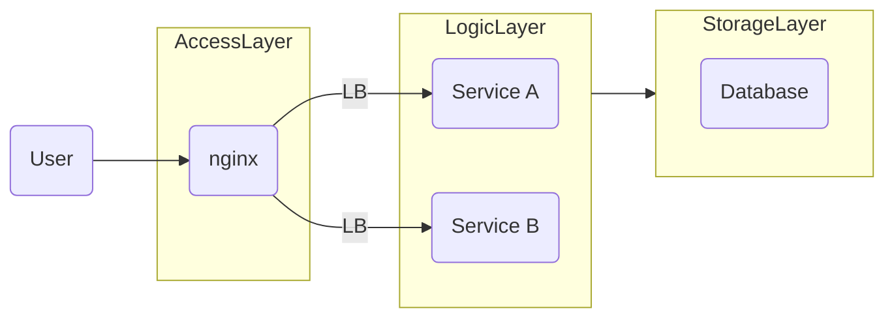

# nginx retry plugin

## Feature

- Currently supports retries for backend services with 502, 503 status codes.
- Allows configurable number of retry attempts and interval duration between each retry.
- Supports http1.1 & http2.
- Easily extensible based on the [retry](src/retry.lua) module.

## Installation

### Nginx with Lua support

Refer to [Dockerfile](docker/nginx-with-lua/docker/Dockerfile).

### Nginx configuration

Refer to the deployment example configuration method [docker/nginx-with-lua/](docker/nginx-with-lua/).

### Plugin Configuration

Available configurations can be referred to in [config](src/config.lua) or modify its parameters at call time [handle_api_with_retry](src/retry_on_request_error.lua#L74).

## Unit Test

```bash
# Build the test environment image (includes nginx with lua support)
make build

make test
```
How to Extend Based on the Retry Mechanism
```lua
    retry:apply_policy(
        "policy-name",
        function(...)
            local res, err = ...
            -- Here, res and err are the return values of a request, you can customize the error logic based on res and err
            -- Return true to retry, return false to not retry
        end,
        -- Maximum number of retries
        max_retries,
        -- Interval duration between each retry
        retry_delay
    )
```

## Performance Comparison
* Compared with native nginx, there is basically no impact on RPS (Requests Per Second) and latency.
* CPU usage will be relatively higher (since there's a Lua plugin involved).
## Application Scenarios

Docker Deployment

Below is a typical SME (Small and Medium-sized Enterprises) WEB architecture diagram


When deploying with docker or docker-compose, during releases, specific services may become temporarily unavailable, leading to direct 502 errors on the frontend.

At this point, you can use the nginx retry Lua plugin from this project at the nginx access layer to retry, maintaining the client's HTTP connection without affecting user experience.

## FAQ

The ngx-retry plugin, when calling backend services to make good use of nginx's built-in upstream mechanism, needs to configure a location identical to the real route in advance in the [service file (refer test configuration)]((docker/nginx-with-lua//conf.d/service.conf)). Carefully compare [docker/nginx-with-lua//conf.d/service.conf](docker/nginx-with-lua//conf.d/service.conf) with [docker/nginx-with-lua/nginx.conf](docker/nginx-with-lua/nginx.conf)'s [test](docker/nginx-with-lua/nginx.conf#L59) route.

## TODO
For the `lua-ngx-retry` plugin to implement its own upstream reading, health check.