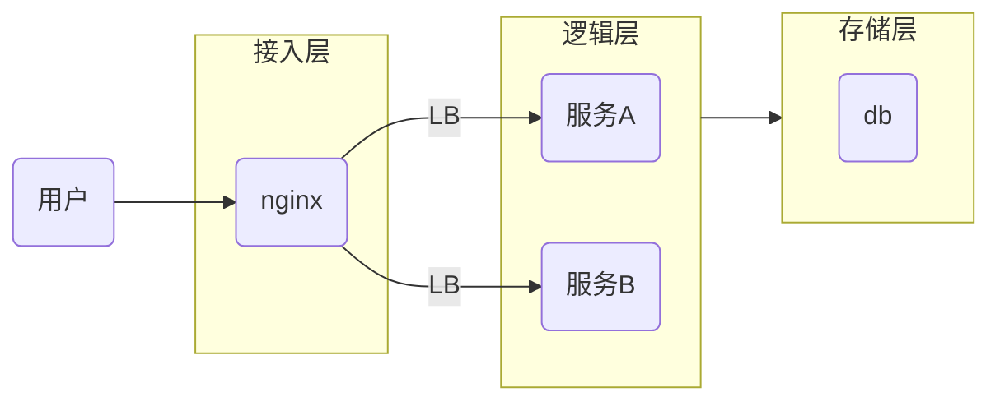

nginx 重试插件(nginx retry plugin)

## feature

- 目前支持基于后端服务 502，503 状态进行重试。
- 允许可配置重试次数和每次重试间隔时长
- http1.1 & http2 支持
- 易基于 [retry](src/retry.lua) 模块进行扩展

## 安装

### 支持 lua 环境的 nginx

可以参考[Dockerfile](docker/nginx-with-lua/docker/Dockerfile)

### nginx 配置

参考测试环境的配置方式[部署实例 docker/nginx-with-lua/](docker/nginx-with-lua/)

### 插件配置

可用的配置可参考[config](src/config.lua) 或者 调用时修改其参数[handle_api_with_retry](src/retry_on_request_error.lua#L74)

## unit test

```bash
# build 测试环境的镜像(包含支持lua的nginx镜像)
make build

make test
```

## 如何扩展基于重试机制

```lua
    retry:apply_policy(
        "poliy-name",
        function(...)
            local res, err = ...
            -- 其中res，err是request返回值，可以根据res，err自定义错误逻辑
            -- 返回true，代表进行重试，返回false，不进行重试
        end,
        -- 最大重试次数
        max_retries,
        -- 每次重试间隔时长
        retry_delay
    )
```

## 性能对比

- 与原生的 nginx 对比，rps 和延时基本无影响
- cpu 会相对高一些（毕竟有 lua 插件）

## 场景应用

#### docker 部署

如下是典型中小企业 WEB 架构图



一般使用 docker 部署或者 docker-compose 部署时，当进行发版时，特定的服务会短暂不可用，此时前端会直接 502 错误。

此时，可使用本项目的 nginx 重试 lua 插件，在接入层 nginx 进行重试，保持客户端的 http 链接，不影响用户体验。

## 疑难问题

ngx-retry 插件在调用后端服务时，为了利用好 nginx 自带的 upstream 机制，需要在[service 文件(参考测试配置)](docker/nginx-with-lua//conf.d/service.conf)
提前配置于真实路由一模一样的 location。仔细对比[docker/nginx-with-lua//conf.d/service.conf](docker/nginx-with-lua//conf.d/service.conf) 和 [docker/nginx-with-lua/nginx.conf](docker/nginx-with-lua/nginx.conf)的[test](docker/nginx-with-lua/nginx.conf#L59)路由。

## TODO

- ngx-retry 插件自己实现 upstream 的读取，health check
